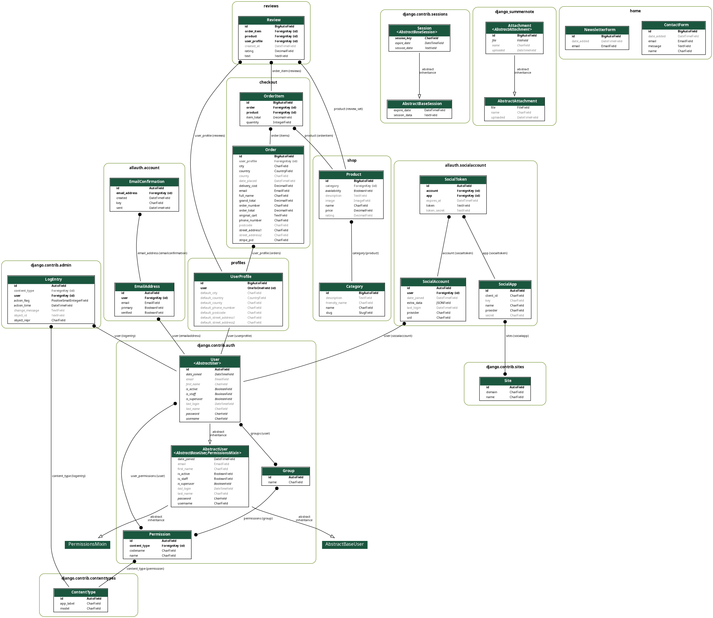

## Greenseed DB Diagram

This DB diagram was created with PyGraphViz

To install run:

Debian based distro:
```
$ sudo apt install python3-pygraphviz
```
<br>

Fedora/RedHat based:
```
$ sudo dnf install python3-pygraphviz
```

or you can run:

```
$ pip3 install pygraphviz
```

pygraphviz is a Python interface to the GrapthViz graph layout and visualization package.

After installing the OS package install django-extensions with:

```
$ pip3 install django-extensions
```

After successful installations of both of these packages add django-extensions to the installed apps of your django project settings.py.


```
INSTALLED_APPS = 
[
    'django.contrib.admin',
    'django.contrib.auth',
    'django.contrib.contenttypes',
    'django.contrib.sessions',
    'django.contrib.messages',
    'django.contrib.staticfiles',
     .....

    'django_extensions', # add this line
     
     
]
```

To generate the graph, run this command:

```
 python3 manage.py graph_models -a -g -o imagefile_name.png
```

### GreenSeed DB diagram

