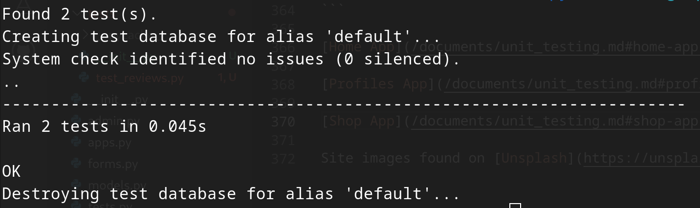

## GreenSeed Unit Testing

### Home App {#home-app}

* Home view

* Our Plants view

* About view

* Contact view

* Fontact Form functionality

* Login functionality

* Logout functionality

 

### Profiles App {#profiles-app}

* Create a user

* Login as user

* Send GET request

* Check if response is OK (200)

* Check that the view returns the correct user

### Shop App {#shop-app}

#### Shop view

* Send a GET request to the view

* Check that the response is 200 (OK)

* Check that the view returns the correct template

#### Product Detail view

* Create a product

* Send a GET request to the view

* Check that the response is 200 (OK)

* Check that the view returns the correct product

* Check that the view returns the correct template

#### Reviews app {#reviews-app}

* Create a user

* Test review form submission

* Login as the user

* Create a new product

* Send a POST request to the view with the ID of the new product

* Check that the response is 302 (redirect)

* Check that a review was added to the database

* Test review form submission with no title

* Check that the correct error message was returned

